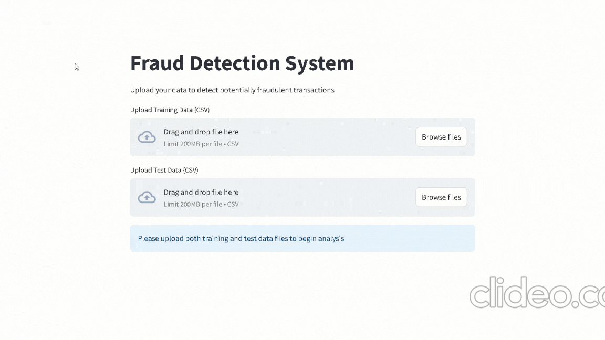

# Fraud Detection System


A supervised learning-based fraud detection system that helps identify potentially fraudulent transactions.



## 🔑 Key Features
- Real-time fraud detection through an interactive Streamlit web interface
- Handles imbalanced datasets using SMOTE
- Comprehensive data preprocessing pipeline including:
  - Automated handling of missing values
  - Feature scaling
  - Categorical variable encoding
- Interactive visualization of fraud probability distributions
- Downloadable prediction reports in CSV format

## 🛠️ Technologies Used
- Python
- Scikit-learn
- Streamlit
- Pandas
- NumPy
- Plotly
- imbalanced-learn

## 📊 Model Details
- Algorithm: XGBOOST
- Preprocessing: StandardScaler, OneHotEncoder
- Handling class imbalance: SMOTE
- Cross-validation with ROC-AUC scoring

## 🚀 Getting Started
1. Clone this repository
2. Install requirements:
   ```bash
   pip install -r requirements.txt
